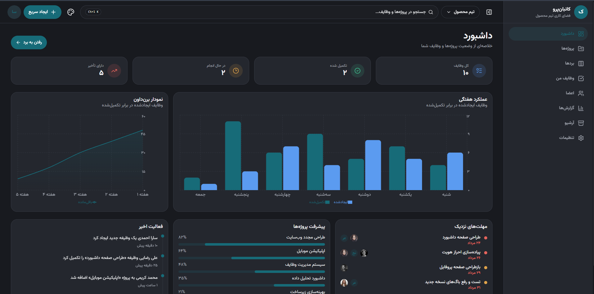
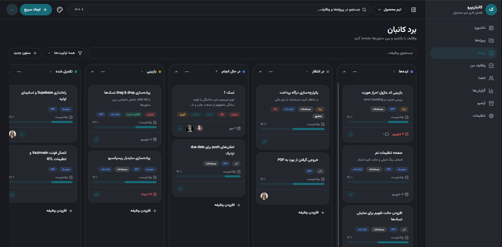

# Kanban App

A modern Kanban project management application built with **React, Zustand, and Supabase**. The application provides a responsive **RTL interface** for organizing tasks, managing projects, and tracking team progress.

## Live Demo

[Kanban App](https://kanban-app-lemon-xi.vercel.app/)

## Screenshots

### Dashboard



### Kanban Board



## Features

- Create, edit, and delete tasks
- Create, rename, and delete Kanban columns
- Drag and drop tasks within and between columns
- Optimistic task reordering with rollback on persistence failure
- Task priorities, labels, assignees, due dates, checklists, and comments
- Search and filter tasks by priority
- Project and member management
- Dashboard with project statistics
- Calendar view
- Reports and performance charts
- Light and dark themes
- Responsive RTL interface

## Technical Highlights

- Implemented drag and drop interactions with `@dnd-kit/react`
- Built optimistic task reordering for responsive interactions
- Added rollback handling when task-order persistence fails
- Managed client-side application state with Zustand
- Integrated Supabase for database operations and relational data
- Built reusable UI components with Radix UI
- Implemented responsive RTL layouts and theme switching
- Created dashboard and reporting visualizations with Recharts
- Structured the application using feature-based architecture
- Separated backend operations into dedicated service modules

## Tech Stack

| Technology       | Purpose                       |
| ---------------- | ----------------------------- |
| React            | UI development                |
| Vite             | Development and build tooling |
| Tailwind CSS     | Styling                       |
| Zustand          | State management              |
| Supabase         | Backend and database          |
| `@dnd-kit/react` | Drag and drop                 |
| React Router     | Routing                       |
| Radix UI         | Accessible UI primitives      |
| Lucide React     | Icons                         |
| Recharts         | Data visualization            |
| React Hook Form  | Form management               |
| Sonner           | Toast notifications           |

## Architecture

The application follows a **feature-based architecture** that separates reusable UI components, feature-specific functionality, application state, and backend services.

```text
src/
├── components/
│   ├── layout/
│   └── ui/
│
├── features/
│   ├── board/
│   │   ├── components/
│   │   ├── services/
│   │   ├── store/
│   │   └── ...
│   │
│   └── ...
│
├── pages/
├── router/
├── lib/
└── styles/
```

This structure keeps features isolated while allowing shared components and utilities to be reused across the application.

## Getting Started

### Prerequisites

Make sure you have the following installed:

- Node.js 18 or later
- npm

### Installation

1. Clone the repository:

```text
git clone https://github.com/bardia-asd/kanban-app.git
cd kanban-app
```

2. Install the dependencies:

```text
npm install
```

3. Create a `.env.local` file in the project root and add your Supabase credentials:

```text
VITE_SUPABASE_URL=your_supabase_project_url
VITE_SUPABASE_ANON_KEY=your_supabase_anon_key
```

4. Start the development server:

```text
npm run dev
```

The application will be available at the local URL provided by Vite.

### Production Build

Build the application for production:

```text
npm run build
```

Preview the production build locally:

```text
npm run preview
```

## What I Learned

This project gave me practical experience building and structuring a larger React application, with a focus on architecture, state management, backend integration, and complex user interactions.

### React Architecture

- Organizing a React application using feature-based architecture
- Separating reusable UI components from feature-specific components
- Managing complex component state and user interactions
- Building responsive and reusable interfaces
- Structuring services and application logic for maintainability

### State Management

- Managing application state with Zustand
- Separating Zustand stores from their actions
- Handling asynchronous operations and loading and error states
- Keeping local state synchronized with persistent backend data
- Managing optimistic UI updates and rollback scenarios

### Supabase

- Using Supabase as a backend and database
- Performing CRUD operations
- Working with relational data such as tasks, labels, assignees, comments, and checklists
- Structuring frontend services around database operations
- Handling persistence and synchronization between the UI and backend

### Drag and Drop

- Implementing drag and drop interactions with `@dnd-kit/react`
- Moving tasks within the same column and between different columns
- Handling task ordering and position updates
- Implementing optimistic updates for responsive interactions
- Restoring the previous state when persistence fails

### UI Development

- Building reusable UI components with Radix UI
- Creating responsive RTL layouts
- Supporting light and dark themes
- Building data visualizations with Recharts
- Designing complex interfaces for task and project management
- Creating accessible and reusable interaction patterns

## Conclusion

This project helped me move beyond building individual React components and focus on **application architecture, state management, data flow, backend integration, and user experience as a complete system**.

It also gave me practical experience handling complex interactions such as drag and drop, optimistic updates, persistence failures, relational data, and responsive RTL interfaces.
